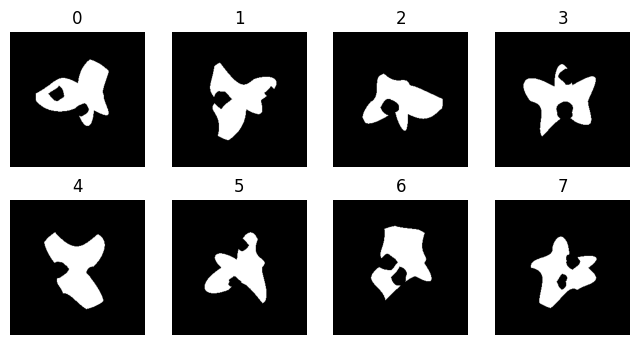
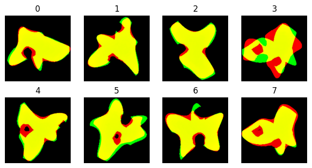
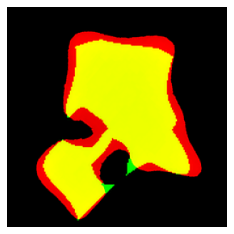

# Volumetric Additive Manufacturing Machine Learning (VAMML) code base

## Overview
This repository is for code related to the VAMML method as described in (pending). This method is designed to generate 2D training data for VAM by creating batches of random shapes to print, then automatically aligns them for training data in an attention U-net model. A visual overview of VAMML:


## Uses

### Shape generation/alignment
The primary function of this code base is for generating and processing random shapes used in voxel arrays for test data generation (See Fig C above). This is primarily achieved via instancing the Experiment class in vamml.Batches.experiment. 

### Attention U-net and data augmentation
An extensible tensorflow model based on the VAMML attention U-net is in vamml/Model, as well as data augmentation tools for unified augmentation of paired images and metadata.

## How to use

There are several interactive python notebooks in the 'examples' folder for how to start and process VAMML experiments, as well as running the VAMML model with custom data augmentations. 

### VAMML batch experiment synopsis

#### Starting an experiment
```python
from vamml.batches import Experiment

expt = Experiment('example_dir/expt_1') # Initializing experiment with a directory.

# Optional: Defining parameters to change (shape generation, etc). See wiki for details on parameters.
pars = {
    'batch_size':8,
    'min_support':0.5,
    'voxel_size':0.05, # Voxel scale in unit/px, unit presumably mm
}
expt.update(pars) # Updating experiment

expt.generate_shapes() # Randomly generates shapes, optimizing for significant differences.
expt.plot_shapes() # Optional visualization of generated shapes.
```



#### Exporting voxels
```python
expt.shapes_to_voxels() # Exports shapes into voxel stack; 
                        # array.dat is a datastring in a default format of uint8 in C order.
expt.save_pars() # Saving parameters for later.
```

After this the array.dat voxel stack is loaded into your volumetric printer (verify compatibility with instrument). Experiment metadata (voxel size, light dose, etc) must be loaded and recorded independently. After printing, prints should be equilibrated for swelling and stained for further automatic processing. By default the VAMML method expects a blue-stained object on a light background, with the gel to be processed the most prominent image feature (other gels on the periphery are ok). Once images are acquired, they should be deposited in ```expt_dir/images```. Images do not need to be name-matched with base shapes, and batches can be run multiple times with images collated to process all at once. Image names are retained during export, so metadata can be included for later handling.

#### Fitting images to shapes
```python
expt = Experiment('example_dir/expt_1', pars=True) # Loading experiment from saved parameters.
expt.process_images() # Processing images into feature maps. Presumes saturated object on bright background.
expt.fit_images() # Fitting feature maps to previously generated shapes by best pairing and rotation.
expt.plot_alignments() # Plotting to verify outcomes.
```



We can verify that the image features (red) align with the base shapes (green) at relative scale. Here we can see that image index 3 is mismatched. We can manually correct this error by looking at the previous shape plot and matching the keys, then manually correcting rotating and mirroring.

#### Correcting fits
```python
expt.correct_alignment(image_number = 3, # Image index to correct
                       shape_fit = 6,    # Matching shape index
                       rotation = 310,   # Rotation in degrees (arbitrary start)
                       mirror = False    # Whether to mirror on x axis

expt.skip_images([3]) # If necessary, any image indices which are too poorly fitting to reasonably
                      # include can be put into added to a list to skip during export.
)
```



With all image alignments corrected, final alignments can be exported at absolute scale. Saving parameters also exports the processed image features and saves alignment data.
#### Final export
```python
expt.export_alignments()
expt.save_pars()
```


## Alternative usage

If you want to use certain VAMML batch generator functions but don't want to use all of the default methods, there are options. 

### Importing prepared shapes/image features

For instance, say you want to use your own random shapes but then use the generator alignment tool. You may upload a numpy array of shape (batch_size,array_size,array_size) and dtype bool as ```expt_dir/arrays/base_shapes.npy```

Similarly, you may import your own array of image features as ```expt_dir/arrays/image_features.npy```. They should be scaled to match the scale of voxel size in experiments, and centered around the feature centroid as based on inertia.

### Alternative processing and generation functions

Functions named in global space may be passed to certain functions for those who wish to use the batch experiment framework. 

#### Image processing

An alternative processing function should be passed to  ```expt.process_images``` at runtime. 

#### Shape generation

As the shape rendering function is dynamically called at many points in the processing pipeline, any custom functions should be added to the ```self.__shape_fcn_map``` function map along with appropriate pars['shape_method'] adjustment.
An alternative shape rendering function may be passed to the ```expt.get_shape``` method for testing.