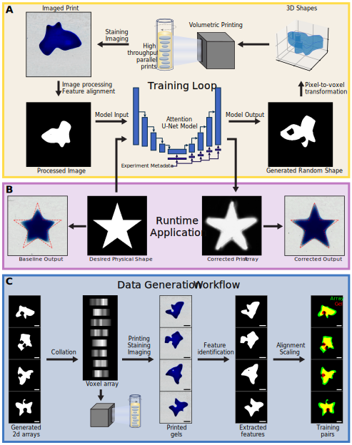

# Volumetric Additive Manufacturing Machine Learning (VAMML) code base

## Overview
This repository is for code related to the VAMML method as described in (pending). This method is designed to generate 2D training data for VAM by creating batches of random shapes to print, then automatically aligns them for training data in an attention U-net model. A visual overview of VAMML:

## How to use

There are several interactive python notebooks in the 'examples' folder for how to start and process VAMML experiments, as well as running the VAMML model with custom data augmentations.
